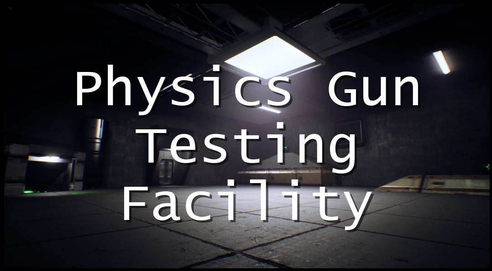
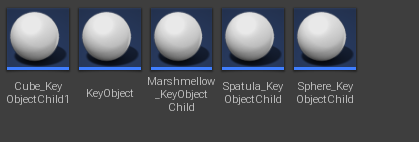
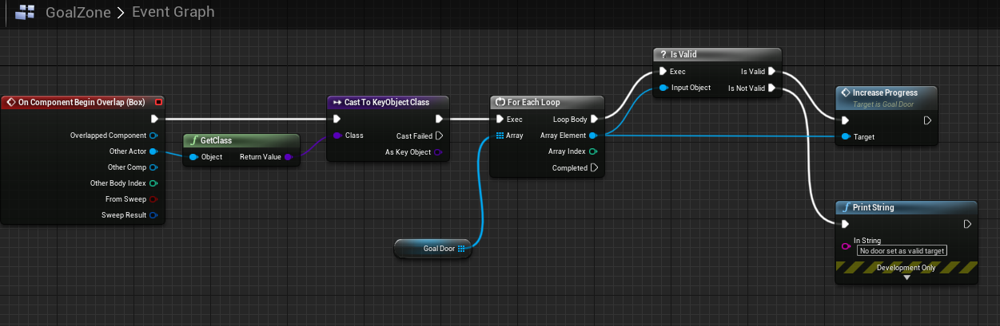
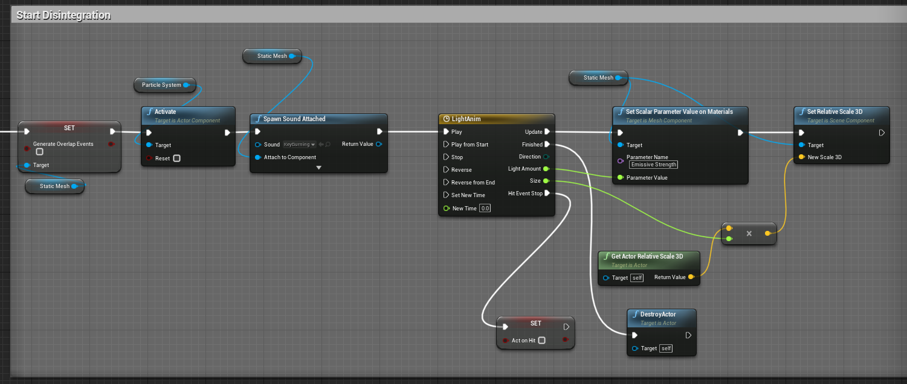
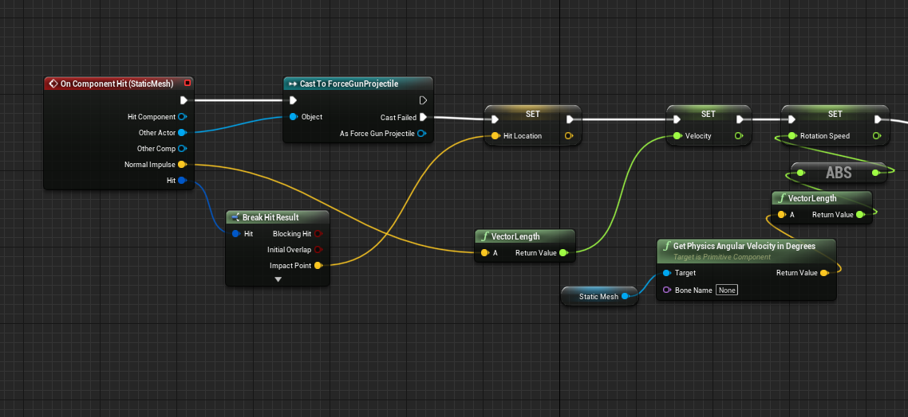
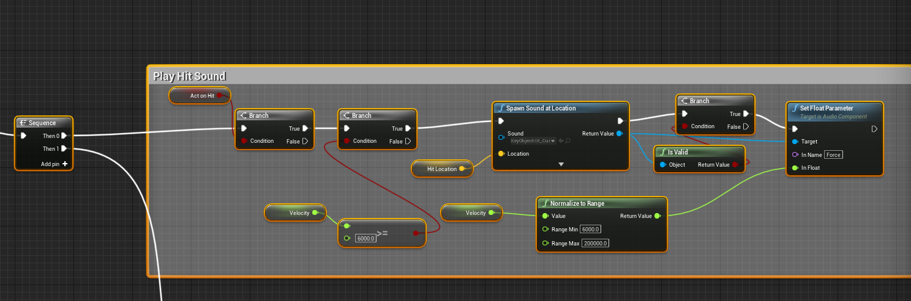
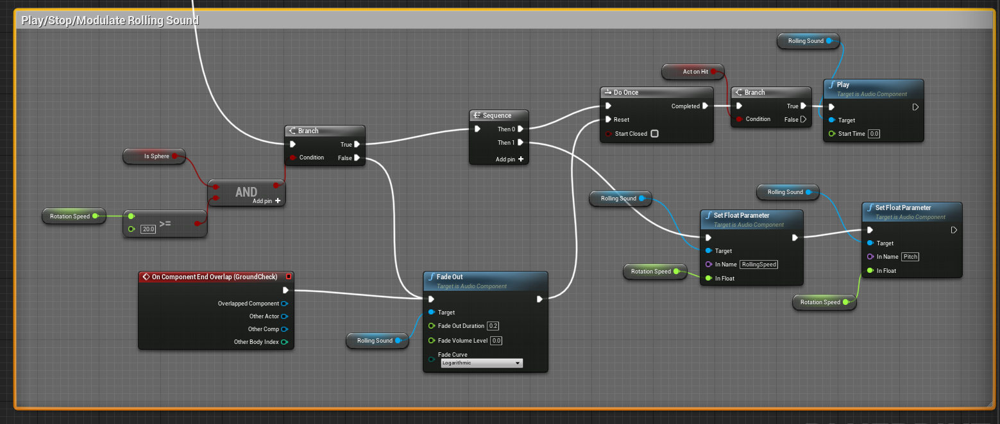
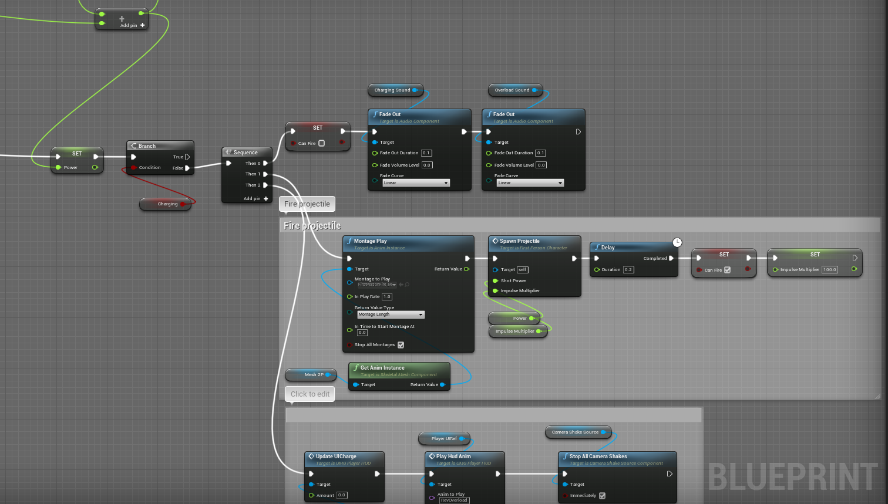
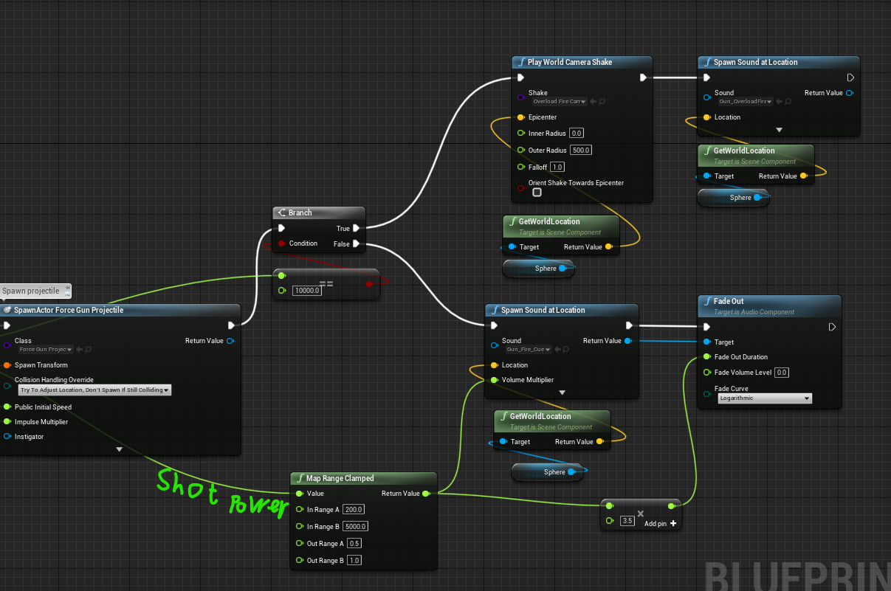
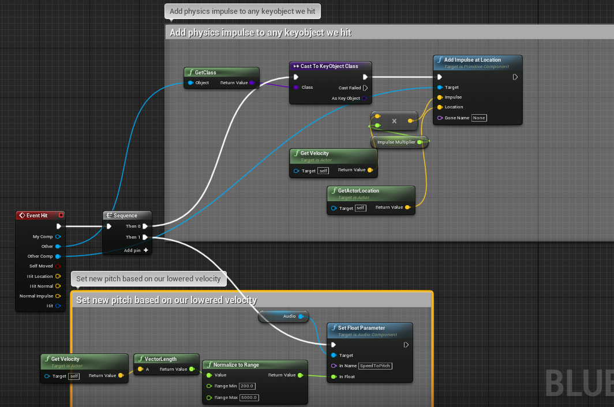

# Devlog

This was a game I had incredible fun making while learning the ins and outs of Unreal 4. Here i will show some parts of coding i did in Unreal blueprint.

## Key mechanic

I needed objects that I could push around and have act as keys for the doors, and I wanted them to have whatever mesh I wanted, So I made one parent class called KeyObject that all my actual keys could inherit from. 

An advantage for this was that when an object overlaps a goal it can simply cast to the parent class and all the children would be considered as valid objects. 

Apart from the Inheritance, the keys functionality are mostly tied to the physics on the meshcomponent. I did, however, work alot to make them look and sound good. 

This is called when a key enters a goal:

Onhit function for sound design. Here a bunch of data is gathered to use only for determining what sound shall be played and at what volume.

This is then what Is done with the data.

The sounds that play are part of the *sound cue* system of Unreal 4. They have the neat capability to be their own self contained programmable systems similiar to how materials are coded in UE4. For instance in the hit sound example the cue chooses a random hit sound among 3 pools of Hard, medium, and soft impacts, based on the normalized value send in. 

## Gun Handling

For this project I started with the first person shooter template and modified it to suit my game idea of shooting to push objects around.

I wanted to to be able to charge up how hard the shots would push objects so I made these on the playercharacter blueprint:

The power value is the most important value here. When the mouse is pressed a timeline plays which increases the power value over time. I then use that value to set the projectiles velocity, and the gunfire sound´s volume and duration as it plays.  

On the projectile blueprint I set it up like this:

I added an Impulse multiplier here because the velocity needed to move the objects otherwise was way too high. So fast that one barely had time to see them in addition to the physics system working correctly at that point.

Here I also use a cast to check if it's a key object. This game doesnt explore that design space at all but if I could, I would play around with this idea that you can't move other objects with the gun so you have to push a keyobject onto the other object, like Pool meets Half life 2.

This was a look into some interesting parts of coding I did for this project. If anyone wants to know more, email me at Jocke.stenmark@live.se