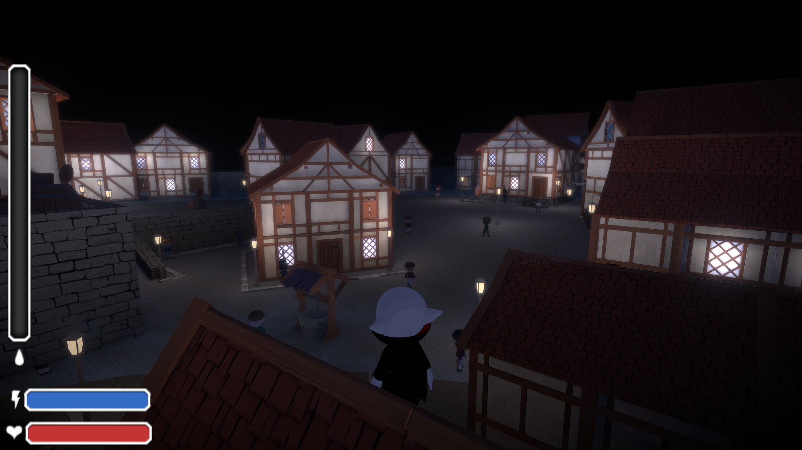

# Devlog

Vampire nights was another school project at Yrgo, where I worked as a programmer and game design lead. <br>

I have a background in audio and music so i'm naturally drawn to programming tasks related to that. In Vampire Nights I made an Audio Manager following the singleton pattern. [Link to Code](https://github.com/NicklasHidesjo/GameProjectTwo/blob/main/GameProjectTwo/Assets/Audio/AudioScripts/AudioManager.cs)

This way whenever I want a sound to play in the games code I can type 
```cs
  AudioManager.instance.PlaySound(SoundTypeEnum.ExampleSound); 
```

It even works for sounds that should play spatilized to a location by including the gameobject that plays the sound as a parameter. This makes it easy to handle most of this game's audio needs without manually adding audiosource components, repeating code, and all the audiofile references can be centralized to one place.

